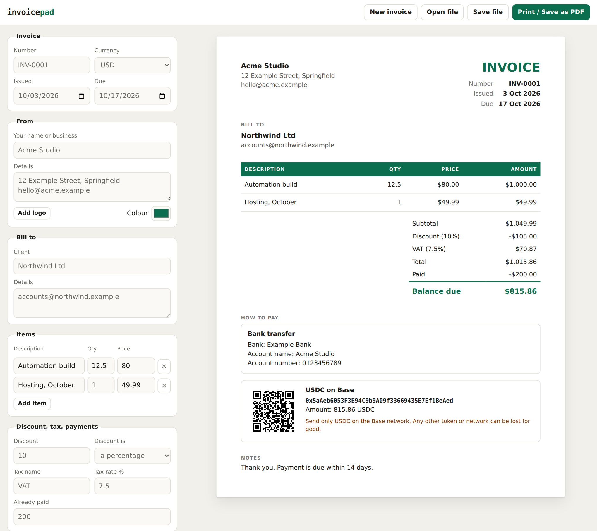

# invoicepad

A free invoice maker for freelancers who get paid by bank transfer or in stablecoins.

**Use it: https://khalydmaina.github.io/invoicepad/**

No sign-up, no watermark, no upload. Fill in the form, press Print, save the PDF.



## Why I built it

Two things kept annoying me about free invoice makers.

The first is the catch: an account to download, a watermark on the PDF, or a
limit of three invoices.

The second is that none of them handle being paid in USDC or USDT properly.
You end up pasting a wallet address into the notes box, and that is how money
gets lost: one wrong character, or a client who sends on the wrong network,
and it is gone for good.

## What it does

- **Normal invoice things.** Line items, discount (percent or fixed), tax with
  your own label, amount already paid, notes, your logo and colour, 20 currencies.
- **Stablecoin payments done carefully.**
  - The wallet address is checked before it goes on the invoice. EVM and Tron
    addresses carry a checksum, so a mistyped character is caught and the
    address is kept off the invoice until it is fixed.
  - The address is printed in full, with a QR code the client can scan.
  - The invoice says which token and which network, with a plain warning to
    use only that one.
  - If the invoice is in dollars, it states the exact amount in USDC or USDT.
- **Exact totals.** All sums are done in whole cents, never floating point, so
  the invoice is never a cent out. (In JavaScript, `1.15 * 100` is
  `114.99999999999999`.)
- **Saves as you type** in your own browser. `Save file` and `Open file` keep
  a copy you can back up or move to another computer.
- **New invoice** keeps your details and payment methods, clears the client,
  and moves the number on from `INV-0007` to `INV-0008`.
- **Prints properly.** Long invoices flow onto more pages without splitting a
  row, on A4 or Letter.
- **Private.** There is no server. Nothing you type leaves your browser.

Supported networks: Ethereum, Base, Arbitrum, OP Mainnet, Polygon, BNB Chain,
Avalanche, Solana and Tron, or name any other.

## Limits, said plainly

- Solana addresses have no checksum, so the page can confirm the format but
  cannot catch every typo. It tells you so, and asks you to compare with your
  wallet.
- It does not convert currencies. An invoice in naira or euros that can also
  be paid in USDC says "the USDC equivalent on the day you pay".
- The QR code holds the address only, not the amount, because that is what
  every wallet and exchange can read.
- Invoices live in your browser's storage. Clearing your browsing data clears
  them, so use `Save file` for anything you need to keep.
- Invoice rules differ by country. Check what yours must show (tax numbers,
  wording) and put it in the details or notes.

## Run it yourself

It is a static page: `index.html`, `app.js`, `money.js`, `address.js` and one
vendored library. No build step.

```bash
python3 -m http.server      # then open http://localhost:8000
node --test tests/money.test.js tests/address.test.js
```

`money.js` (exact invoice arithmetic) and `address.js` (keccak-256, SHA-256,
EIP-55 and Tron checksums, base58) have no dependencies and work in Node too:

```js
const Address = require("./address.js");
Address.validate("base", "0x5aAeb6053F3E94C9b9A09f33669435E7Ef1BeAed").level;  // "ok"
Address.validate("base", "0x5aAeb6054F3E94C9b9A09f33669435E7Ef1BeAed").level;  // "error"
```

## Credits

QR codes are drawn with [qrcode-generator](https://github.com/kazuhikoarase/qrcode-generator)
by Kazuhiko Arase (MIT), included in `vendor/`.

## License

MIT
